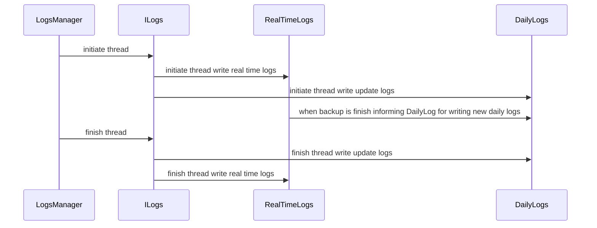

# Diagram sequence Logs :

```mermaid
sequenceDiagram
    LogsManager->>ILogs : initiate thread
    ILogs->>RealTimeLogs : initiate thread write real time logs 
    ILogs->>DailyLogs : initiate thread write update logs 
    RealTimeLogs->>DailyLogs : when backup is finish informing DailyLog for writing new daily logs 
    LogsManager->>ILogs : finish thread
    ILogs->>DailyLogs : finish thread write update logs 
    ILogs->>RealTimeLogs : finish thread write real time logs 
```