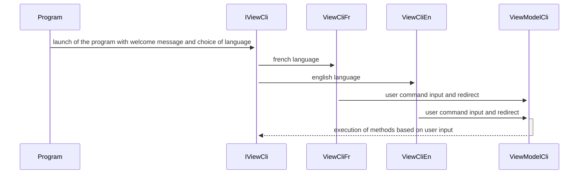

# Diagram sequence View :

```mermaid
sequenceDiagram 
Program->>+IViewCli: launch of the program with welcome message and choice of language
IViewCli->>+ViewCliFr: french language
IViewCli->>+ViewCliEn: english language
ViewCliFr->>+ViewModelCli: user command input and redirect
ViewCliEn->>+ViewModelCli: user command input and redirect
ViewModelCli-->>-IViewCli: execution of methods based on user input

```
