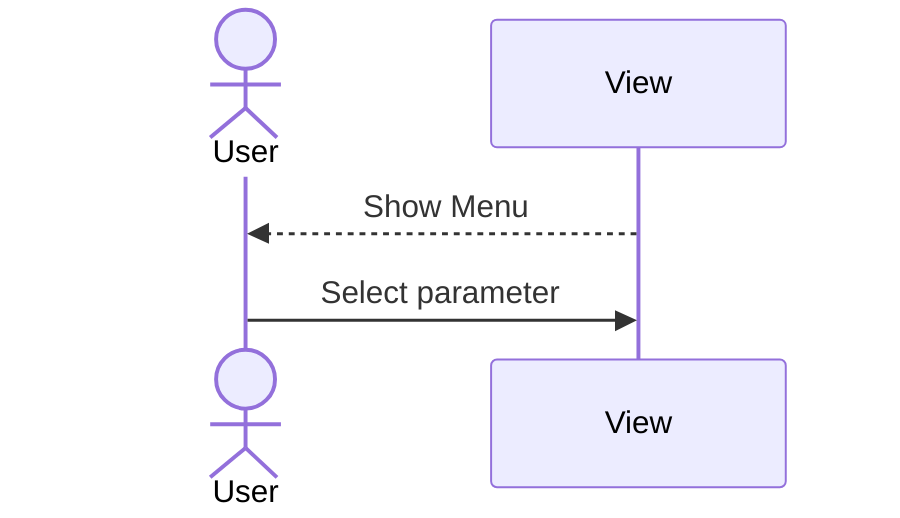
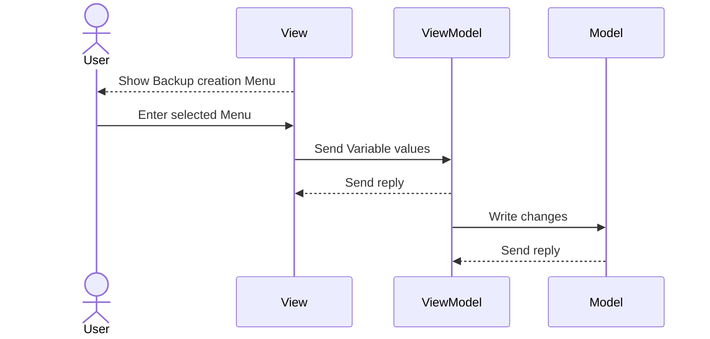
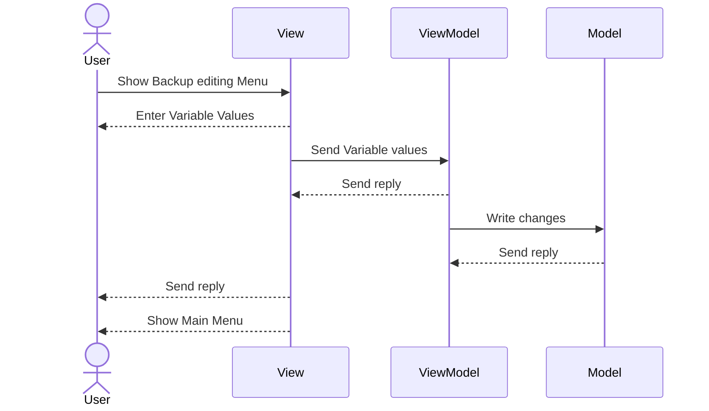
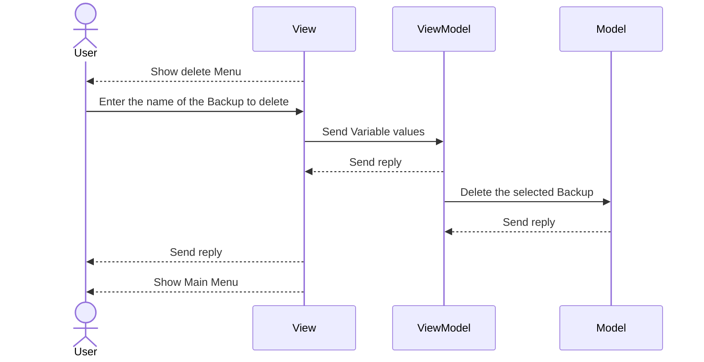
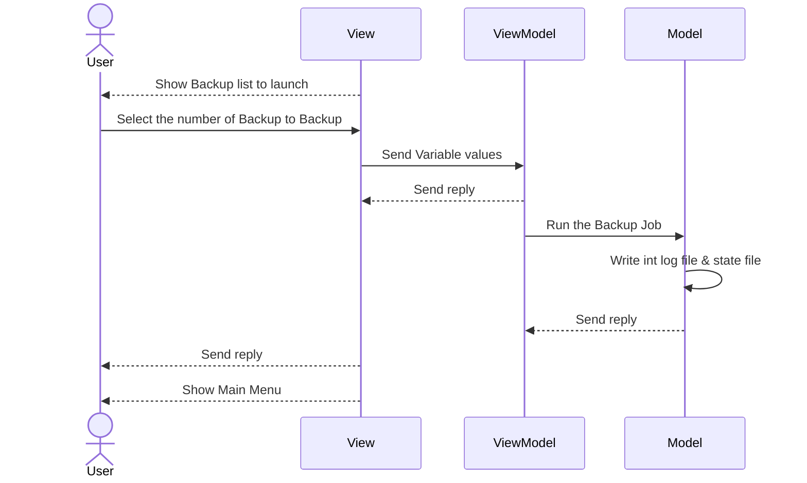
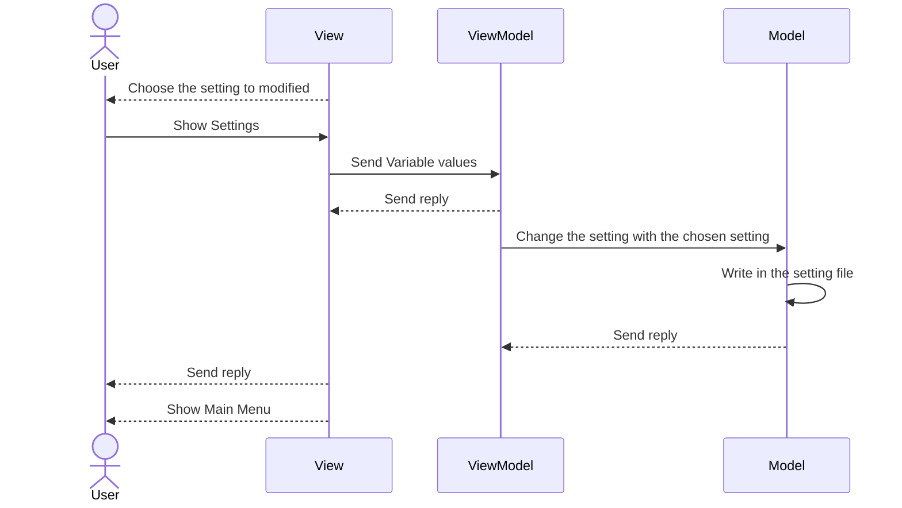
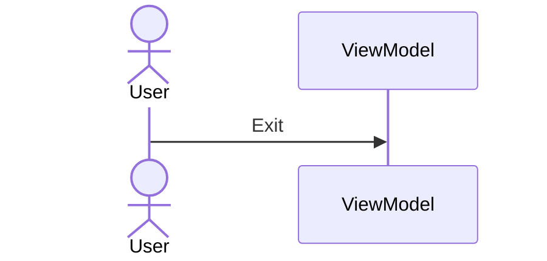

Main Menu of the CLI

```mermaid
sequenceDiagram
Actor User
View -->>User: Show Menu
User->>View: Select parameter
```
Create a Backup

```mermaid
sequenceDiagram
Actor User
View -->>User: Show Backup creation Menu
User ->>View: Enter selected Menu
View ->>ViewModel: Send Variable values
ViewModel -->>View: Send reply 
ViewModel ->>Model: Write changes
Model -->>ViewModel: Send reply
```

Editing a Backup

```mermaid
sequenceDiagram
Actor User
User ->>View: Show Backup editing Menu
View -->>User: Enter Variable Values
View ->>ViewModel: Send Variable values
ViewModel -->>View: Send reply 
ViewModel ->>Model: Write changes
Model -->>ViewModel: Send reply
View -->>User: Send reply
View -->>User: Show Main Menu
```

Deleting a Backup

```mermaid
sequenceDiagram
Actor User

View -->>User: Show delete Menu
User ->>View: Enter the name of the Backup to delete
View ->>ViewModel: Send Variable values
ViewModel -->>View: Send reply 
ViewModel ->>Model: Delete the selected Backup
Model -->>ViewModel: Send reply
View -->>User: Send reply
View -->>User: Show Main Menu
```
Launch a Backup

```mermaid
sequenceDiagram
Actor User

View -->>User: Show Backup list to launch
User ->>View: Select the number of Backup to Backup
View ->>ViewModel: Send Variable values
ViewModel -->>View: Send reply 
ViewModel ->>Model: Run the Backup Job
Model ->>Model: Write int log file & state file
Model -->>ViewModel: Send reply
View -->>User: Send reply
View -->>User: Show Main Menu
```
Change configuration

```mermaid
sequenceDiagram
Actor User

View -->>User: Choose the setting to modified
User ->>View: Show Settings
View ->>ViewModel: Send Variable values
ViewModel -->>View: Send reply 
ViewModel ->>Model: Change the setting with the chosen setting
Model->>Model: Write in the setting file
Model -->>ViewModel: Send reply
View -->>User: Send reply
View -->>User: Show Main Menu
```
Exit the CLI

```mermaid
sequenceDiagram
Actor User
User ->>ViewModel: Exit
```

