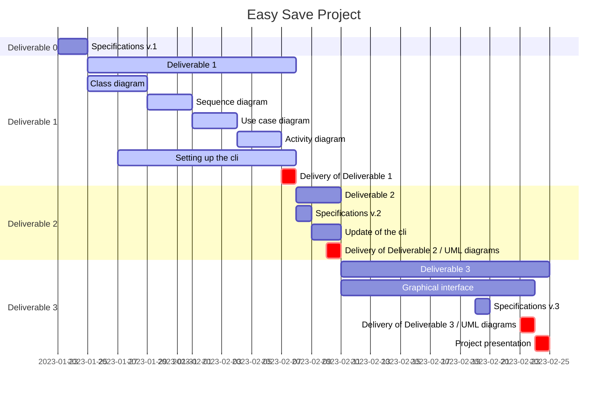

```mermaid
gantt
dateFormat  YYYY-MM-DD
title Easy Save Project

section Deliverable 0
Specifications v.1  :  des1, 2023-01-23 ,2d

 

section Deliverable 1 
Deliverable 1               :active, des2, 2023-01-25,14d
Class diagram               :active, des3, 2023-01-25,4d
Sequence diagram            :active, des4, after des3,3d
Use case diagram            :active, des5, after des4,3d
Activity diagram            :active, des6, after des5,3d
Setting up the cli          :active, des7, 2023-01-27,12d                                                                                                                                                                                                                                                                                                                                       

Delivery of Deliverable 1   :crit, 2023-02-07,1d  

section Deliverable 2
Deliverable 2                            :      des8,  2023-02-08,3d
Specifications v.2                       :      des9, 2023-02-08,1d
Update of the cli                        :      des10, after des9,2d
Delivery of Deliverable 2 / UML diagrams :crit, des11, 2023-02-10,1d

section Deliverable 3
Deliverable 3                                 :      des12, 2023-02-11,14d
Graphical interface                           :      des13, 2023-02-11,13d
Specifications v.3                            :      des14, 2023-02-20,1d
Delivery of Deliverable 3 / UML diagrams      :crit, des15, 2023-02-23,1d 
Project presentation                          :crit, des16, 2023-02-24,1d
```