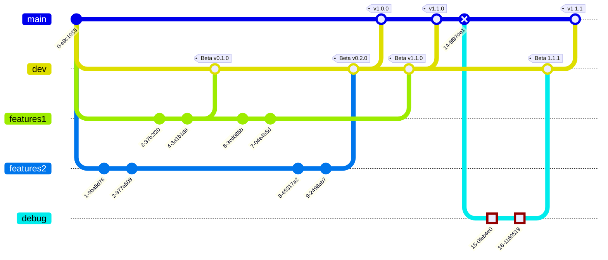

# CesiProgSys

## Project title : EasySave

## Project description : 

The team has to develop a backup software called EasySave for the software publisher ProSoft. The software will be sold at 200 € HT with an annual maintenance contract at 12% of the purchase price. The team must respect constraints concerning the development tools and methods, the language used, the readability of the code and the user documentation. The project must also be managed in such a way as to reduce the development costs of future versions and to guarantee rapid reactivity in the event of a malfunction.

## Authors

- @Jxstine2002
- @mboss7
- @TanguyGackel
- @Louis410

## Terms of reference :

[Terms of reference](TermsOfReference.md)

## Documentation

[Deliverable_L1_Documentation](Deliverable_L1_Documentation.docx)

## UML diagrams

Project organisation

[Gantt](/Diagrams/Gantt.md)

System analysis

[Use case diagram](.\Diagrams\DiagUseCase.md)

System presentation

- [Class diagram](.\Diagrams\DiagClasse.md)
- [Sequence diagram](.\Diagrams\DiagSequences)
- [Activity diagram](.\Diagrams\DiagActivity.md)

## Branch organization :

## 🚀 About Us

Nous sommes une équipe soudée et dynamique, travaillant en étroite collaboration pour développer des applications innovantes et efficaces.

Notre équipe est composé de programmeurs, d'ingénieurs logiciels et de chefs de projet, tous déterminés à fournir les meilleures solutions informatiques pour répondre aux besoins de nos clients.

## Logo

## Used By

This project is used by ProSoft.
