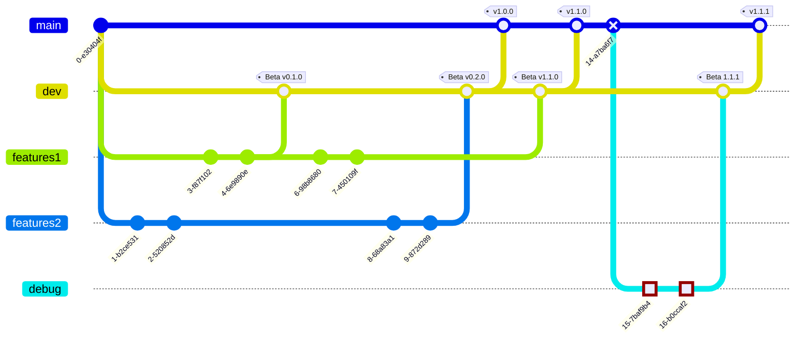

# CesiProgSys


# Attendu du projet 

## Livrable 1 : 


# Structures et usages :

Pour détecter modification des fichiers : comparatif des hash (md5 pour rapidité)


Création application console 
Puis mise en place d'une interface déporté en vias tcp. 

Montrer etat d'avancement. 


Penser a une version qui fonctionne sur Windows et Linux


[](https://mermaid.live/edit#pako:eNpNUctKxEAQ_JVmvC5-QG6yCyq4IAT0kks700ka5uU8VmXZf_G635Efs-PqJs0cBqqqq2rmqHQwpBrl2BuHsfOdB5m7GKHFeqABkyHY3oAJxVMBHRJdKPO8UMocPJj6jyOY6dyz57SwXLWFy5gIzUo6nRP3rLH8LqAMD5hHiKEmOFwwSuCCuZLyIn4OOfMbWy7TWbSgR_SD0C3K8UNdRdyK7Z8F2DCslkhHy0AetvsdaMt6gfZzYogWC_UhOWjgiX39BCn4Kg8VPvItLOyW_JJm-p5TaMyZVpR7ytee2s7gKsijL5R61ARDwjjye6U5ViIXCkHRURapjXKUHLKRzzrO2k6VkRx1qpGroR4lc6c6fxIq1hLaL69VU1KljarRSJUdoxg41fRoM51-AL1ZqN0)

App Sauvegarde C# dotnet core
Version du dotnet a définir
multithread
Vérification des Hash pour vérifier modifications
Possibilité de changer la langue
Creation de logs
Appli en CMD clic
Multi plateform : Linux et Windows.
Sensibilité à la casse
Gestion des classes
Interface graphique en remote tcp

Exemple de fonctionnement du projet:


## Sujet avec contraintes :

```
Version 1.0

Description du livrable 0 : Environnement de travail
Votre équipe doit installer un environnement de travail respectant les contraintes imposées par ProSoft.

Le bon usage de l'environnement de travail et des contraintes imposées par la direction seront évalués tout au long du projet.

Une vigilance particulière sera portée sur :

la gestion de GIT (versioning)

les diagrammes UML à rendre 24 heures avant chaque livrable (Jalon)

La qualité du code (absence de redondance dans les lignes de code)

 

Description du livrable 1 : EasySave version 1.0
Le cahier des charges de la première version du logiciel est le suivant :

Le logiciel est une application Console utilisant .Net Core.

Le logiciel doit permettre de créer jusqu'à 5 travaux de sauvegarde

Un travail de sauvegarde est défini par

Une appellation

Un répertoire source

Un répertoire cible

Un type (complet, différentiel)

Le logiciel doit être utilisable à minima par des utilisateurs anglophones et Francophones

L'utilisateur peut demander l'exécution d'un des travaux de sauvegarde ou l'exécution séquentielle de l'ensemble des travaux.

Les répertoires (sources et cibles) pourront être sur :

Des disques locaux

Des disques Externes

Des Lecteurs réseaux

Tous les éléments du répertoire source sont concernés par la sauvegarde

Fichier Log journalier :

Le logiciel doit écrire en temps réel dans un fichier log journalier l'historique des actions des travaux de sauvegarde. Les informations minimales attendues sont :

Horodatage

Appellation du travail de sauvegarde

Adresse complète du fichier Source (format UNC)

Adresse complète du fichier de destination (format UNC)

Taille du fichier

Temps de transfert du fichier en ms (négatif si erreur)

Exemple de contenu: Sample_log.pdf [pdf]

Le logiciel doit enregistrer en temps réel, dans un fichier unique, l'état d'avancement des travaux de sauvegarde. Les informations à enregistrer pour chaque travail de sauvegarde sont :

Appellation du travail de sauvegarde

Horodatage

Etat du travail de Sauvegarde (ex : Actif, Non Actif...)

Si le travail est actif :

Le nombre total de fichiers éligibles

La taille des fichiers à transférer

La progression

Nombre de fichiers restants

Taille des fichiers restants

Adresse complète du fichier Source en cours de sauvegarde

Adresse complète du fichier de destination

exemple de contenu : Sample_state.pdf [pdf]

Les emplacements des deux fichiers (log journalier et état) devront être étudiés pour fonctionner sur les serveurs des clients. De ce fait, les emplacements du type « c:\temp\ » sont à proscrire.

Les fichiers (log journalier et état) et les éventuels fichiers de configuration seront au format JSON. Pour permettre une lecture rapide via Notepad, il est nécessaire de mettre des retours à la ligne entre les éléments JSON. Une pagination serait un plus.

Remarque importante : si le logiciel donne satisfaction, la direction vous demandera de développer une version 2.0 utilisant une interface graphique WPF (basée sur l'architecture MVVM)

 ```
