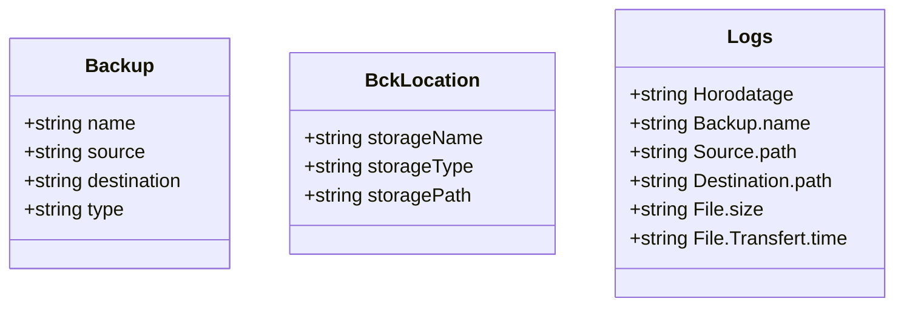

# Diagramme de Class : 



    

# Diagram de class simplifié : 
 ```mermaid    
 classDiagram
     class BckApp
     BckApp <|-- BckAppInterface_Model
     BckAppInterface_Model <|-- CLI_View_Model
     CLI_View_Model <|-- CLI_View
    
    
    
    
    
    
    
```

modif 