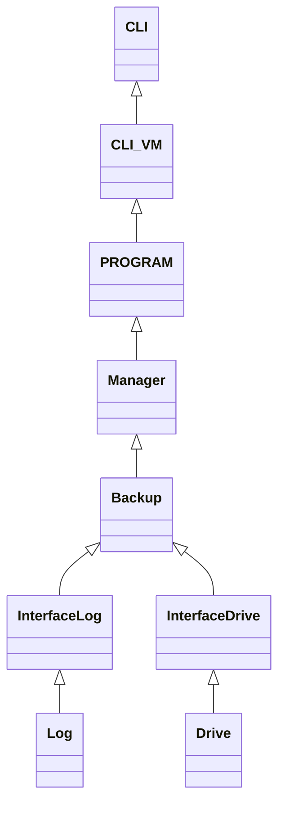

# Wiki 

## Library :

http://dev-dot.net/6-classes-system-io/

# MVVM 

Model ->  backup / log (Real time / Daylie /drive 

View -> CLI

View - Model ->

Design patern Mediator.

Eviter relations fortes !  

