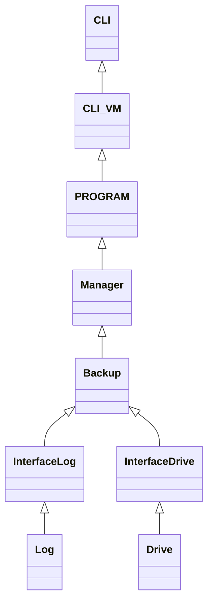

# Wiki 

## Library :

Information sur les fichiers : 

http://dev-dot.net/6-classes-system-io/

Librairy et fonction gestion et copy des fichiers : 

https://learn.microsoft.com/fr-fr/dotnet/api/system.io.file.copy?view=net-7.0

https://learn.microsoft.com/fr-fr/dotnet/csharp/programming-guide/file-system/how-to-copy-delete-and-move-files-and-folders

# MVVM 

Model ->  backup / log (Real time / Daylie /drive 

View -> CLI

View - Model ->

Design patern Mediator.

Eviter relations fortes !  

