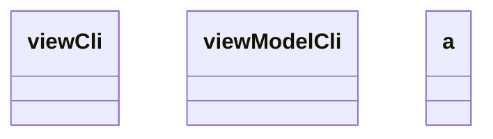

Class manager
-> class backup abstraite (plusieurs threads, géré par manager) -> nom, répertoire source et cible
    -> backup_complete
    -> backup_différentiel

-> class 7zip proposer à l'utilisateur de compresser ou non

translate :  2 vues, une française, une anglaise

class config : sauvegarde la langue, un mode de detection des extensions des fichiers, sauvegarde par défaut, sauvegarde récente

class LOG abstraite : (format json, et eviter les emplacements de type temp)
    log journalier -> horodatage, nom, adresse unc source et destination, taille du fichier, temps de transfert final (negatif si erreur)
    log temps réel -> etat d'avancement des travaux de sauvegarde, nom horodatage, (si actif, nombre total de fichiers, taille des fichiers, progressions ..)

