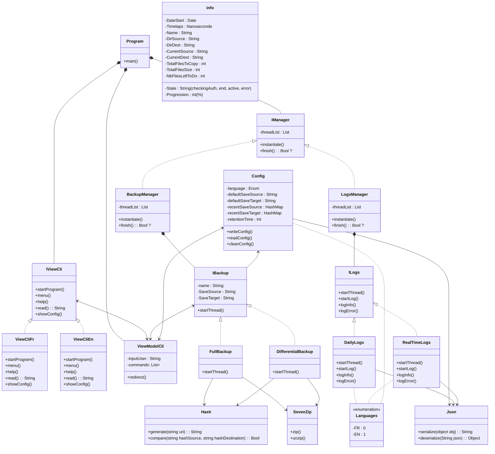

//TODO update le diag classe pour inclure le fait que la ckasse realtimelogs doit recupérer les infos depuis les classes de backup, puis une fois la backup fini transmettre les infos à la classe dailylogs
//TODO Le backup manager doit aussi recup des infos depuis le viewmodelCli, pour savoir cb de threads il doit créer notamment
//TODO ou peux etre pas ;.. je sais pas
//Todo IBackup ne doit pas communiquer avec Config ? enfin je pense

Class manager
-> class backup abstraite (plusieurs threads, géré par manager) -> nom, répertoire source et cible
    -> backup_complet
    -> backup_différentiel
    -> backup_incrémentiel

-> class 7zip proposer à l'utilisateur de compresser ou non

translate :  2 vues, une française, une anglaise (tableau de delegate pour la lecture des commandes)

class config : sauvegarde la langue, un mode de detection des extensions des fichiers, sauvegarde par défaut, sauvegarde récente

class LOG abstraite : (format json, et eviter les emplacements de type temp)
    log journalier -> horodatage, nom, adresse unc source et destination, taille du fichier, temps de transfert final (negatif si erreur)
    log temps réel -> etat d'avancement des travaux de sauvegarde, nom horodatage, (si actif, nombre total de fichiers, taille des fichiers, progressions ..)

